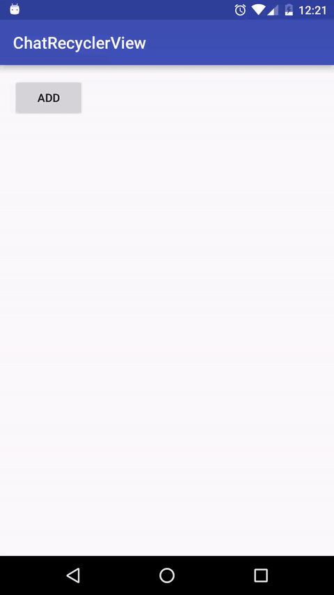

# ChatRecyclerView
Implement your user friendly chat RecyclerView in one line!

## 缘由
对于一个有聊天功能的 APP 来说, 如果来了新消息, 那当然应该滚动到最新的消息, 但是如果用户此时正在查看以前的消息,
那强行滚动到最新消息是不是会让用户很抓狂呢? 最理想的效果就是: 如果用户当前正在翻看历史消息, 来了新消息就不要
自动滚动到最新消息处, 如果用户停止翻看历史消息一段时间, 再来了新消息, 就自动滚动到最新消息处。当然你也可以更激进,
用户停止翻看历史消息一段时间之后, 即便没有新消息, 也自动滚动到最新消息处。

## 效果



## 用法

### 添加依赖
``` gradle
allprojects {
    repositories {
        maven {
            url  "http://dl.bintray.com/piasy/maven"
        }
    }
}

compile 'com.github.piasy:ChatRecyclerView:1.0.0'
```

### 代码使用
layout 代码:

``` xml
<com.github.piasy.chatrecyclerview.ChatRecyclerView
        android:id="@+id/mChatRv"
        android:layout_width="match_parent"
        android:layout_height="200dp"
        android:layout_alignParentBottom="true"
        />
```

java 代码:

``` java
// 三个参数依次是: 新消息塞进去的 position、用户停止翻看历史消息多少 ms 之后自动滚动、
// 是否没有新消息也超时滚动
// 在为 recycler view 进行设置 adapter 等初始化时调用
chatRecyclerView.initAutoScroll(0, 3000, true);

// 在为 adapter 添加新数据之后调用, 注意, 你不要调用任何 adapter.notify*** 方法,
// 否则效果会有问题
chatRecyclerView.notifyNewMessage();
```